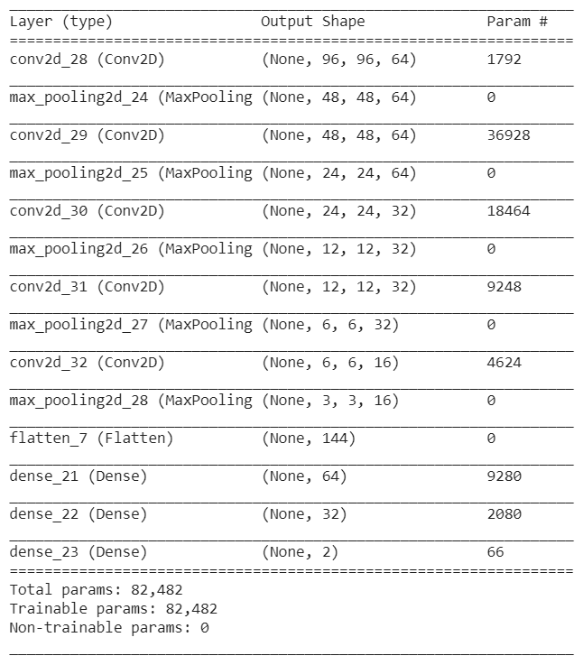
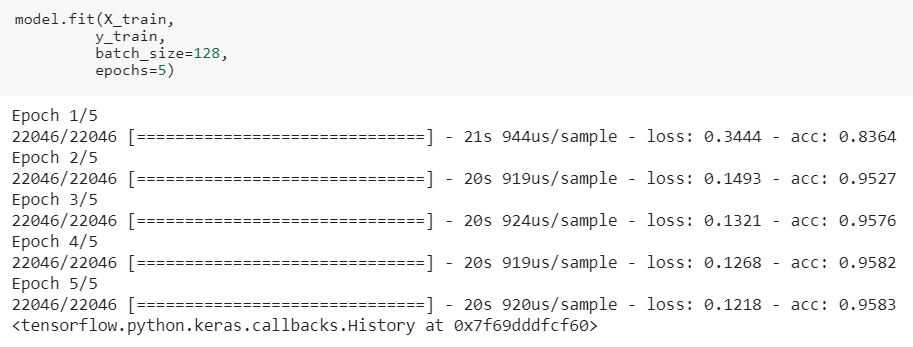
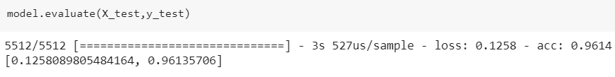

# Detecting-Malaria

- - - - 

## Tools Used

* [Keras](https://keras.io/)
* [OpenCV](https://opencv.org/)
* [Matplotlib](https://matplotlib.org/)
* [NumPy](http://www.numpy.org/)
* [DataLoader-for-MachineLearning-Frameworks](https://github.com/rumeetsingh/DataLoader-for-MachineLearning-Frameworks)

- - - - 

## Dataset Description

* [Malaria Cell Images Dataset](https://www.kaggle.com/iarunava/cell-images-for-detecting-malaria)

### Content
The dataset contains 2 folders - Parasitized - Uninfected

And a total of 27,558 images.

### Acknowledgements
This Dataset is taken from the official NIH Website: [https://ceb.nlm.nih.gov/repositories/malaria-datasets/](https://ceb.nlm.nih.gov/repositories/malaria-datasets/).

### Inspiration
Save humans by detecting and deploying Image Cells that contain Malaria or not!

- - - - 

## Keras Model Details

### Model Summary

### Training

### Testing

